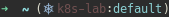

kctl: Kubernetes prompt for bash and zsh
============================================

A script that lets you manage local Kubernetes context and namespace per terminal.

Inspired by several tools used to simplify usage of `kubectl`.



## Installing

### Antigen

```sh
antigen bundle a-bouts/kctl
```

### From Source

1. Clone this repository
2. Source the kctl.plugin.zsh in your `~/.zshrc` or your `~/.bashrc`

#### Zsh

Edit `.zshrc`
```sh
PROMPT='$(kctl)'$PROMPT
```

#### Bash

Edit `.bashrc`
```sh
PS1='[\u@\h \W $(kube_ps1)]\$ '
```

## Aliases

### Usefull commands

|Command           |Description                                                  |
|------------------|-------------------------------------------------------------|
|`kns namespace`   |change current terminal namespace to `namespace`             |
|`ksetns namespace`|change current context namespace to `namespace`              |
|`kctx context`    |change current terminal context to `context`                          |
|`ksetctx context` |change current context to `context`                          |
|                  |                                                             |
|`kgpo`            |`kubectl get pod`                                            |
|`kglpo`           |`kubectl get pod $last` where $last is the last deployed pod |
|`klol`            |`kubectl logs -f $last` where $last is the last deployed pod |
|`kexl`            |`kubectl exec -it $last` where $last is the last deployed pod|
|`kdrain node`     |drain the node `node`                                        |


### Syntax explanation

`$last` refer to the last modified object

* **`k`**=`kubectl`
* commands:
  * **`g`**=`get`, **`gl`**=`get $last`
  * **`y`**=`get -o yaml (| yh)`, **`gl`**=`get $last -o yaml (| yh)`
  * **`d`**=`describe`, **`dl`**=`describe $last`
  * **`rm`**=`delete`, **`rml`**=`delete $last`
  * **`a`**:`apply -f`
  * **`k`**:`apply -k`
  * **`ex`**: `exec -i -t`, **`exl`**: `exec -i -t $last`
  * **`lo`**: `logs -f`, **`lol`**=`logs -f $last`
* resources:
  * **`po`**=pod, **`dep`**=`deployment`, **`ing`**=`ingress`,
    **`svc`**=`service`, **`cm`**=`configmap`, **`sec`**=`secret`,
    **`ns`**=`namespace`, **`no`**=`node`, **`j`**=`job`, **`cj`**=`cronjob`,
    **`r`**=`role`,**`rb`**=`rolebinding`,
    **`cr`**=`clusterrole`, **`crb`**=`clusterrolebinding`,
* flags:
  * **`w`**=`-w/--watch`

## Prompt Structure

The default prompt layout is:

```
(<symbol>|<context>:<namespace>)
```

If the current-context is not set, kctl will return the following:

```
(<symbol>|N/A:N/A)
```

## Enabling/Disabling

If you want to stop showing Kubernetes status on your prompt string temporarily
run `kctloff`. To disable the prompt for all shell sessions, run `kctloff -g`.
You can enable it again in the current shell by running `kctlon`, and globally
with `kctlon -g`.

```
kctlon     : turn on kctl status for this shell.  Takes precedence over
             global setting for current session
kctlon -g  : turn on kctl status globally
kctloff    : turn off kctl status for this shell. Takes precedence over
             global setting for current session
kctloff -g : turn off kctl status globally
```

## Customization

The default settings can be overridden in `~/.bashrc` or `~/.zshrc` by setting
the following environment variables:

| Variable | Default | Meaning |
| :------- | :-----: | ------- |
| `KCTL_BINARY` | `kubectl` | Default Kubernetes binary |
| `FLUX_BINARY` | `flux` | Default Flux binary |
| `KCTL_NS_ENABLE` | `true` | Display the namespace. If set to `false`, this will also disable `KCTL_DIVIDER` |
| `KCTL_PREFIX` | `(` | Prompt opening character  |
| `KCTL_SYMBOL_ENABLE` | `true ` | Display the prompt Symbol. If set to `false`, this will also disable `KCTL_SEPARATOR` |
| `KCTL_SYMBOL_DEFAULT` | `⎈ ` | Default prompt symbol. Unicode `\u2388` |
| `KCTL_SYMBOL_USE_IMG` | `false` | ☸️  ,  Unicode `\u2638` as the prompt symbol |
| `KCTL_SEPARATOR` | &#124; | Separator between symbol and context name |
| `KCTL_DIVIDER` | `:` | Separator between context and namespace |
| `KCTL_SUFFIX` | `)` | Prompt closing character |
| `KCTL_CLUSTER_FUNCTION` | No default, must be user supplied | Callback function on context changed |
| `KCTL_NAMESPACE_FUNCTION` | No default, must be user supplied | Callback function on namespace changed |

For terminals that do not support UTF-8, the symbol will be replaced with the
string `k8s`.

To disable a feature, set it to an empty string:

```
KCTL_SEPARATOR=''
```

## iTerm2 profiles

An iTerm2 profile can be used per cluster (using specific theme on prod cluster)

Add following function to your .zshrc file and create iTerm2 profiles using kubectl context names.

```bash
function _set_profile() {
  echo -e "\033]50;SetProfile=Default\a"
  echo -e "\033]50;SetProfile=$1\a"
  echo "Set profile $1"
}

export KCTL_CLUSTER_FUNCTION=_set_profile
```

## Colors

The default colors are set with the following environment variables:

| Variable | Default | Meaning |
| :------- | :-----: | ------- |
| `KCTL_SYMBOL_COLOR` | `blue` | Set default color of the Kubernetes symbol |
| `KCTL_CTX_COLOR` | `red` | Set default color of the context |
| `KCTL_NS_COLOR` | `cyan` | Set default color of the namespace |
| `KCTL_BG_COLOR` | `null` | Set default color of the prompt background |

Blue was used for the default symbol to match the Kubernetes color as closely
as possible. Red was chosen as the context name to stand out, and cyan for the
namespace.

Set the variable to an empty string if you do not want color for each
prompt section:

```
KCTL_CTX_COLOR=''
```

Names are usable for the following colors:

```
black, red, green, yellow, blue, magenta, cyan
```

256 colors are available by specifying the numerical value as the variable
argument.
